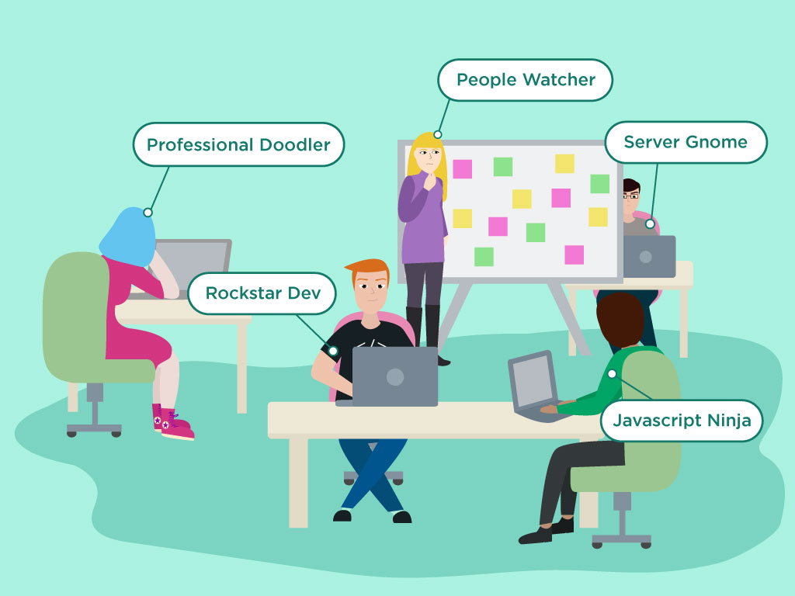
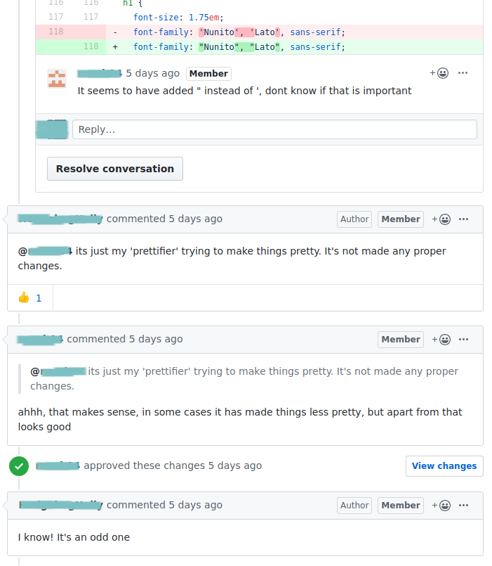
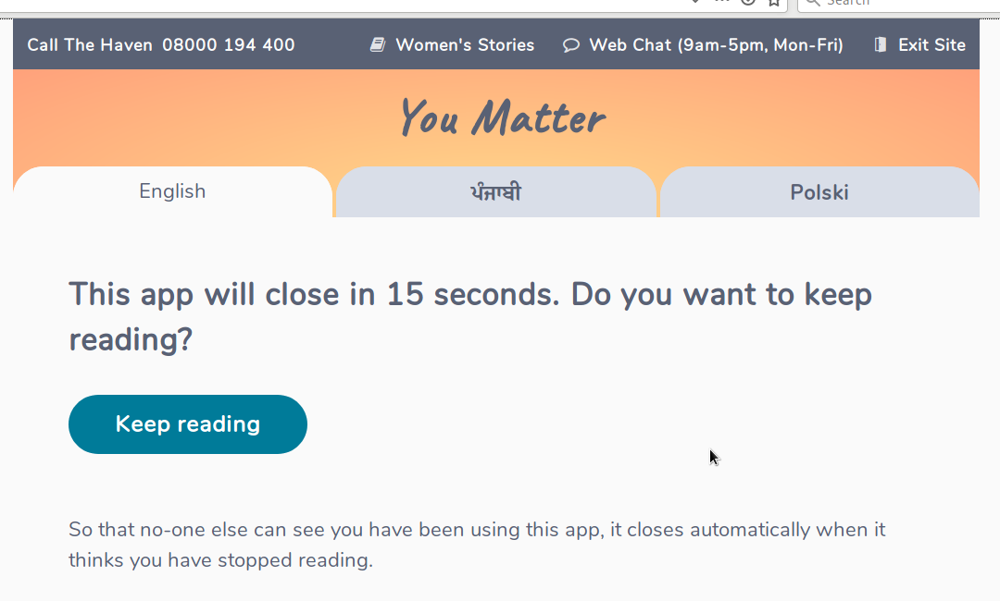
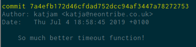
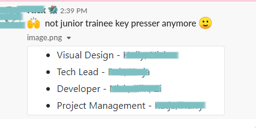
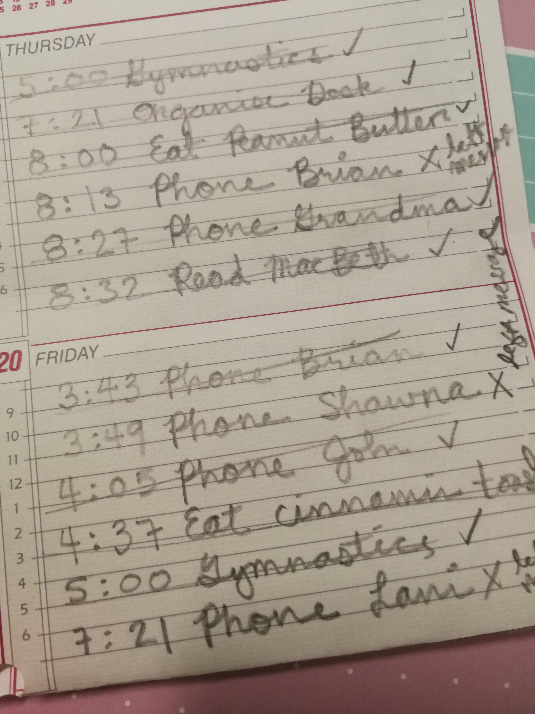
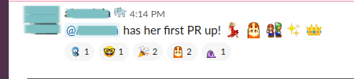
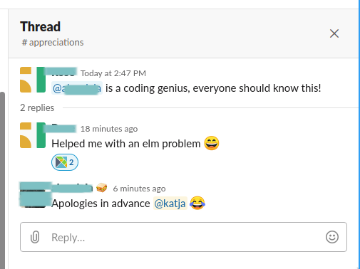

# Growing an Elm app with the whole team

---

## Katja Mordaunt

I like being nice & getting good stuff done.

Note:
- Developing software in small teams over decade with Neontribe. Work with non-profits to build digital tools that compliment their over-stretched services
- also raising children for a 1/4 century & dabbled industries
- Noticed things about how people work together/ behave in groups/ treat each other& been involved in projects that break down because of communication
- Going to share some practical tips - and talk about how and why I think Elm helps make happier, more productive teams
- Much of talk, things you know - but important to give teams & people confidence to spend effort making a "be nice" atmosphere. Maybe I'll say something didn't know too!
- Anyway if you know all this stuff - I'll make you feel good about what you are already doing.

---

## 2 years ago...

New project!
- ~~python, php, wordpress, drupal, symfony, laravel~~
- jquery... handlebars... angular... vue...

<!--.element class="fragment" -->

Note:
- Usually projects have lead front and lead back
- No backend...
- I'd been down the jquey, handlebars, angular, vue route and was suspiscious of js
- Not confident I wouldn't make a mess
- Same time was playing with clojure and haskell and feeling like funtional was a safe / predictable space
- TICK: Someone mentioned Elm

+++

## So we're going with Elm?

TODO: evolve haven site with some code & elm seasons

Note:
**Had some ups and downs, but we built a thing**
- We had convresations around Elm being the wrong tool / over-engineering
- Made me reflect that we need to learn to trust each other's tech - and knowlegde & ability to evaluate and make choices in good faith
- I tried to explain that - yes Elm can make more complex apps safer but it's also a solid foundaiton for any UI
- Unfortunately not everyone agreed with me but we shipped... and most of the company forgot about it.

+++

## All happily going about our work

"Is there anything anyone needs help with?" - Illustrator <!-- .element class="fragment" data-fragment-index="1" -->

Note:
- **One year on - Success, now make some more**
- Translate the original & roll out some clones
- Upgrade to 19 - Manager I think we can handle the translation & upgrade
- Maybe better port the app to html/js for the clones so more people can work on it?
- Manager was thinking in terms of labels but
- TICK: But precisely because it was in Elm, I had a hunch I'd be able to rely on people in my team who didn't yet identify themselves as coders.
- So when Holly - who'd been with us for 3 months, stepped forward after standup...
- Yes! There is something I need help with.

---

## Stumbling down the path together...
<!-- .element class="fragment" -->

with Holly!<!-- .element class="fragment" -->

Note:
- Historically Neontribe - was a bunch of developers - but all from backgrounds
- We filled in the non-developer jobs, but recently, hired a few people with little to no coding experience to support us with those tasks.
- Those new hires were the ones who had a bit more time on their hands. So we set off:
- Myself and the other developer who'd worked on the original app
- A user researcher with a maths degree who'd done a bit of coding and had lots of experience in the charity sector - to lead the discovery and liaise with clients
- TICK: and of course, Holly a recent arts graduate and illustrator who wanted to help
- We hit all the same problems every software project has...
- It didn't all go swimmingly .. but this is what worked well and how Holly helped me reflect on where our process could be better

---

## Beginners welcome
We need beginners in our community and in our teams

Note:
- Few months ago a woman turned up at London Elm Code night
- She'd been making websites in the 90's and taken a break to her kids.
- Her kids had been encouraging her for the past year or so to get back into coding.
- She'd signed up to emails for lots of events & coding meetups but didn't have the confidence to go to any.
- Until she saw the Elm Code night reminder. Aparently the only one of all those mailings about coding expliitly said "beginners welcome" So she plucked up the courage and came along.
- Wasn't what she was expecting - but it worked out. We gave her an overview of where we are now in the industry.
- Afterwards I spoke to mario one of organisers about whether we should clarify - but we agreed that no, it was perfect to have people like her coming along.
- Healthy communities and projects need newcomers with fresh perspectives.

+++

## The beginners on your team will appreciate guidance
- What do new team members need to know<!-- .element class="fragment" data-fragment-index="1" -->
- Check in regularly<!-- .element class="fragment" data-fragment-index="2" -->
- Set guidelines for code review<!-- .element class="fragment" data-fragment-index="3" -->
- Talk about how to talk about code<!-- .element class="fragment" data-fragment-index="4" -->

Note:
- Now that we had Holly on board - Common sense tips
- TICK: Keep minimal - what new team members need to know
- TICK: Have short converstions often
- TICK: Code review for beginnres easier in Elm. Guidelines give newcomers more confidence. (e.g. changes to the model, does it introduce duplication? Richard Feldman elm conf 2018, naming Ally Kelly McKnight Elm 2018, 	
Seiya Izumi Code review strategy elm eu 2019)
- https://speakerdeck.com/izumisy/our-journey-with-the-biggest-elm-app-in-japan?slide=30
- TICK: Felienne Hermans how code sounds

+++

## Brand new to coding

PIC: TODO, img all the overwhlmeing things about setting up environs.
- mac, windows, linux, which linux, vs code, sublime, atom
- node, nvm, yarn, git...
- Elm + text editor<!-- .element class="fragment" -->

Note:
- When Holly first joined the project - she didn't have a dev environment set up.
- But I didn't think that should be a barrier.
- I even got our testing manager to submit directly to github when noticed there were no issue templates in place.
- Afterall it's only text and the first few issues were editing existing copy.
- TICK: New developers and non-developers productive quickly. Why/ how Elm helps
- Elm framework does not get in the way - easy to set up - no massive boilerplate to navigate round, no complicated toolchain to understand.
- No more need to know how ot configure a postfix server than we do need to know how to write safe js in order to be good at our jobs

---

## Everyone's voice 
TODO Holly PR example<!-- .element class="fragment" -->
TODO Code review looks good :thumbsup:<!-- .element class="fragment" -->
<!-- .element class="fragment" -->

Note:
- TICK: Once Holly was set up - she started submitting more than just text changes.
- I remembered a time when another colleague had been coding for about a year - one day he said - seems like all we do every day is go round in circles rewriting each other's code in our own style
- Sometimes these refectors are important and sometimes they aren't. As with everything I am saying - the important thing is to consider what you are doing and why - in the context of your circumstance.
- "because of his experience, I was careful to try and let her do it her way"
- Collaboration means everything should not be in your style and the project's style should evolve
- What is the value in being competative? Collaboration is the opposite of heroic leadership.
- TICK: We talked about not being afraid to write more than "Looks good" + emoji in code reviews
- She got more confident in her responses.
- TICK: Sometimes you come across code you don't understand - don't rewrite it or ignore it - Ask about it.

+++

## Team style not indy style

<blockquote class="fragment">"You must have faith in your colleagues' competence and good intentions. Very likely the problem you perceive is an indication of tradeoffs you don't yet understand" - Rupert (Neontribe)</blockquote>

Note:
- Declarative style of Elm allows people to discover own "how". Many routes to same endpoint. Give everyone ownership of own journey - don't instruct on how, give them a framework that guides them.
- When Holly comes back to this codebase in 6 months or a year, she'll appreciate that she had a hand in these decisions - and that she was allowed to wander a bit..
- We don't often take perfect path first time round, nor do we often take decisions without thinking.
- TICK: My colleague Rupert sums that up...
- More people in the team means less burden on the individual. can be outside of core team and be there for bouncing ideas off occassionally or jump in when deadlines loom.
- Remember that sometimes things made along time ago or in a hurry (there's always a story)
- We are all capable of making mistakes

+++

## Different perspectives

<!-- .element class="fragment" -->

Note:
- I had a valuable learning exp with another colleague from that original Elm project.
- Tick/sync model story
- TICK: Because of that I am not so quick to dismiss the thoughts of newcomers to the project - no matter what their experiece.
- Everyone's voice is valid. Sometimes with less knowledge, we can point out a much simpler way.
- Especially if we are looking at a small part of the big picture in collaboration. More overview sometimes makes it seem more complicated than it needs to be.
- Those people with the new ideas - might only say them once very quietly. Listen out.
- It's important to remember to trust your team.

---

## Language forms culture

Labels can be confusing
<!-- .element class="fragment right" -->

Team without labels is just "team"<!-- .element class="fragment" -->

Note:
- Remeber that picture of my team?
- If we'd stuck to thinking of Holly as an illustrator - we'd probably not have been able to deliver this project on time.
- If you label something as X... people will be lazy about assigning value/ use cases to it. If you don't label, people use own experience/ imagination.
- Rockstars: veteran = learned stuff over time, bit by bit = unforgettable knowledge(nuemerym, base64), baby = natural skill, 
- Labels can be put there by self or others: self tagged = someone who doesn't know what they don't know, boss tagged = pressure to cover gaps in knowledge / keep up appearance of deep knowledge.
- Kids expect you to be able to do everything. So bosses who have labelled you.
- Guilty of that with Holly + illustrator skills
- TICK: If the company supports, should be able within 3 months to eliminate a lot of the vocab that diminishes peoples identity junior, trainee, etc. can be developer
- TICK:...

+++

## Elm (language and the community) encourages inclusivity & collaboration
Instead of "Oh, no, this is too difficult for you" 

... we can say "Sure, let me explain"

Note:
- Prototyping in paper means you don't have to "get it right" the first time. Elm has that too. Trainee never coded before, confident to let them loose. Hardly had to explain anything.
- Supportive compiler etc... mitigates fear of failure and makes us more equal (Emma Cunningham Elm EU)
- Elm good language for communicating ideas to different types of "expertese" or "experience" (Jono Mallanyk Elm EU)
- Much of engineering constraints taken care of by constraints of Elm

---

## Code for people
"Mum you are not a computer..."

"OK, thanks google."

Note:
- My daughter likes to remind me that I am not a robot
- From the lists I made when I was a kid, I'm not so sure...
- There were certainly times where I was talking to Holly saying things like thats just a function, TODO more here... and then had to pause "You're not following, are you? Nope.
- We do need to remember we are humans, not robots - both when we speak to each other and when writing the code.
- Think about the future readers and writers of your codebase
- Our efficiancy needs are different to theirs.
- refactor/ review should focus on making easier for everyone
- The people matter more than the cleverness of the code.

+++

## Naming stuff blah, blah, blah...
- CODE: Naming stuff is hard, refactoring in Elm is easy.
- TODO REMOVE?: Demo search replace in another language + use Keys file evolution
- TODO specific example of naming conventions?
- Verbose can be good

Note:
- True - decisions are hard.
- I encouraged Holly let the names start off how she thought of them and let them evolve naturally
- Instead of saying make a thing called this that does that, I framed tasks as... make a thing that does this.
- Encouraging Holly to name stuff without hesitation, meant I could know more about what she was thinking and how much she understood about what the code was doing.

---

## Nature of bugs
- TODO CODE: syntax error in json ended up in release
- TODO - delete? PIC: compare vue.js, php, react vs. Elm cards/ issues (counts?)

Note:
- Holly's story is the syntax error from before editor installed.
- remember when I said it didn't matter that Holly had no ide when she started - not entirely true.
- manual testor visited the page. Similar error was caught at deploy with Elm... still got merged in.
- CODE: Keys file also good for copy. Anyone can edit, 1/2 way to cms - don't need the extra mapping layer
- CODE: react vs Elm vs vue vs drupal i18n - json is hard to read, database is a comlpicated abstraction to keep in sync
- Translation framework turned out to be a useful step on way to branding
- CODE: Keys file also good for copy. Anyone can edit, 1/2 way to cms - don't need the extra mapping layer
- There will be bugs - but catching them at compile time is great

+++

## Elm helps "You got this" for future us

- Functional pieces are atomic<!-- .element class="fragment" -->
- Easy to read the code and see what it does<!-- .element class="fragment" -->

Note:
- TODO - Holly?
- It applies to all of us, not just people who are new to coding.
- If your code confuses another developer - no matter what their level of experience, consider adding comments about why you did it that way. You'll thank yourself.
- Remember we don't all have knowledge of all the domains we work in.
- Ironically, experienced developers seem to have more trouble reading Elm than beginners
- Let's try to make them less suspicious / guarded
- TICK: Someone can fix/ implement a part without knowing the whole. No hidden effects, nuances.
- TICK: No behind the scenes functional magic. More predicatble. the only magic is turning it into js.
- Elm makes people friendsly code - good for beginners, teams + future for every project no matter level of experience/ time.

---

## It starts to make you happy...
Elm starts to make you happy<!-- .element class="fragment" -->

...sooner<!-- .element class="fragment" -->

<!-- .element class="fragment" -->
<!-- .element class="fragment right" -->

Note:
- At Elm europe I was trying to explain to someone why I like using Elm...
- TICK: My colleague ponited out that you get happy With other languages/ frameworks too, but there is a lot more head banging and theory before we can reach the happy point.
- TICK: And - Holly isn't the only one feeling that joy!
- **Before next** Pretty sure every one in the room has experienced ...gotten upset or made someone upset - or even cry as a result of how project was going & how your team was communicating.
- I want to share some questions with you that I've been asking myself since I started this exploration of how we can work better in our teams
- I can't tell you what the answers are for you and your situation. But I think it's worth taking some time to think about them in the context of your own teams and projects.

---

### How can we create spaces and cultures where we don't feel pressure to appear to "be the best at everything, all the time"?

Note:
- We are all trying to be our professional best. Give each other a break.
- People have different levels of confidence (arbitrarily determined). Why intimidate each other? Encourage everyone to speak.
- Single track hierarhies are meaningless. We all have parallel skills. We are building a compilation, not a tower.
- We all want to be great at something and it should not matter what that something is.

+++

### How can we improve the democracy of our collaborations?

Note:
- No more those who git and those who do not - dividing lines in the teams we work in.
- Clients included - it's their product, share your code with your clients. The appreciate knowing a little.
- Everyone has skills/ knowledge/ experience to bring to the table
- We should be encouraging people to try stuff and showing them how. Not pretending it's too hard.
- We don't often put user needs of devs to top priority of scoping. e.g. better install docs, less assumptions of project specific knowledge

+++

### Do labels and job roles prevent us from sharing knowledge openly?

Note:
- easy to hurt each other's feelings / judge each other's tech
- If everyone had to know everything to acheive success... nonsense, you don't need to know chemistry to bake a cake, but it might help you invent a better one.
- Why does community encourage people to hide knowledge or guard it or hide lack of knowledge/ Academic culture suffers this

+++

## What we can do as a community
- Labeling each other probably doesn't help - let's stop doing it.<!-- .element class="fragment" -->
- The variety of our knowledge is valuable - let's keep learning and sharing.<!-- .element class="fragment" -->
- No one should feel left out - let's work on inclusivity.<!-- .element class="fragment" -->

Note:
- TICK: We all feel dumb and vulnerable sometimes. The important thing is not to box others in or judge them.
- TICK: Ignorance is a universal condition - no one knows everything.
- TICK: Within this community, at least - I am pretty certain that we all mean well - so let's listen to anyone who finds themselves next to us in this space, no matter what their journey to get here.
